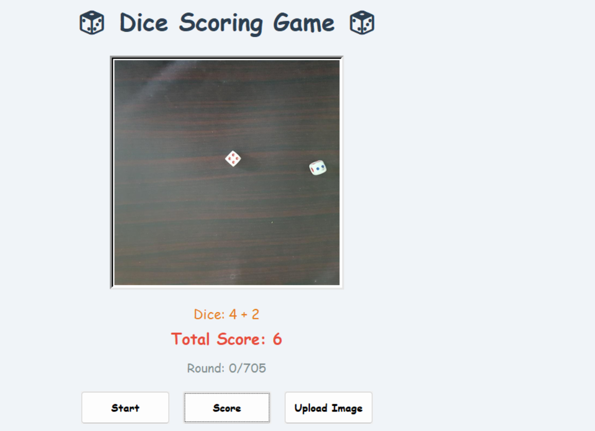
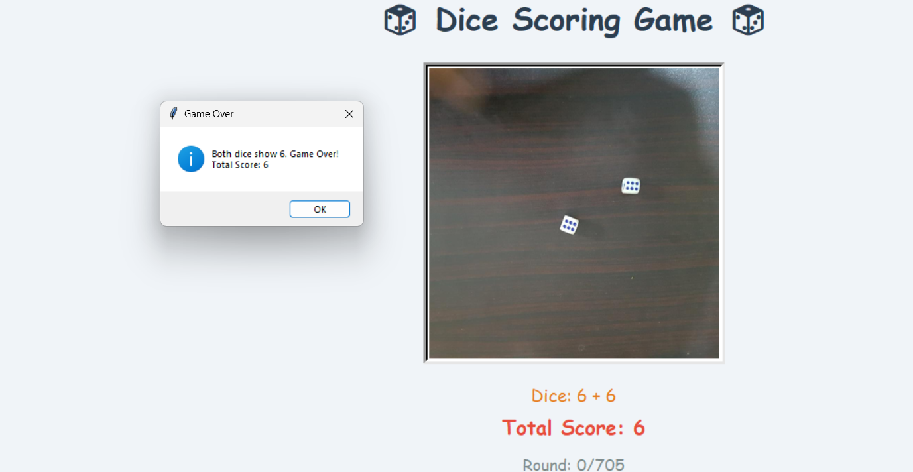

# Dice-Game-using-Object-detection

A computer vision project that uses **YOLO** to detect and classify dice faces (1–6) from images. It covers the full pipeline: custom dataset collection and labeling, model training, and a **GUI application** for automatic score calculation using live camera input or offline game image sequences.

---

## Features
- Custom dice dataset (faces 1–6) collected and labeled manually
- YOLO-based object detection model trained on the custom dataset
- Real-time scoring via webcam **or** batch scoring from saved game images
- Simple Tkinter GUI: Start, Score, Upload Image, and Game-Over logic
- High detection accuracy across all six classes

---

## Model Performance

Validation results on the held-out set (53 images, 106 dice instances):


| Class | Images | Instances | Precision | Recall | mAP50 | mAP50-95 |
|:-----:|:------:|:---------:|:---------:|:------:|:-----:|:--------:|
| all   | 53     | 106       | 0.978     | 0.990  | 0.995 | 0.672    |
| 1     | 53     | 21        | 0.988     | 1.000  | 0.995 | 0.602    |
| 2     | 53     | 11        | 1.000     | 0.966  | 0.995 | 0.705    |
| 3     | 53     | 17        | 0.933     | 1.000  | 0.995 | 0.668    |
| 4     | 53     | 18        | 0.989     | 1.000  | 0.995 | 0.766    |
| 5     | 53     | 14        | 0.956     | 1.000  | 0.995 | 0.678    |
| 6     | 53     | 25        | 1.000     | 0.972  | 0.995 | 0.612    |

Model: 157 layers · 7.03M parameters · 15.8 GFLOPs.

---

## GUI Demo

**Main scoring screen** — detects both dice and sums their values:



**Game-Over rule** — the round ends when both dice show 6:



---

## Quick Start

```bash
# clone
git clone https://github.com/Mhassanbughio/Dice-Game-using-Object-detection.git
cd Dice-Game-using-Object-detection

# install deps
pip install -r requirements.txt

# run the GUI
python gui/app.py

yolo detect train data=data/dice.yaml model=yolov8n.pt epochs=100 imgsz=640

Author
Muhammad Hassan Bughio — GitHub

